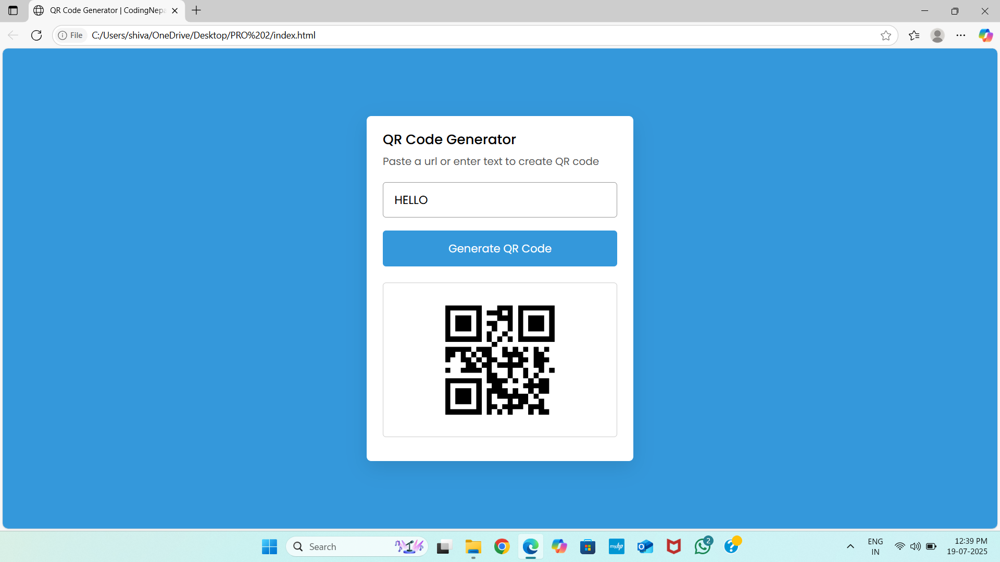

# 🔳 QR Code Generator

A clean and responsive web application that dynamically generates QR codes from user-provided input. Built using **HTML, CSS, and JavaScript**, this project demonstrates core front-end development skills, DOM manipulation, and API integration.

---

## 📌 Project Overview

This QR Code Generator allows users to input any text or URL and instantly get a QR code representation of that data. The project uses the **[GoQR API](https://goqr.me/api/doc/)** to create QR codes in real-time and provides a seamless user experience with a minimal and modern UI.

---

## 🎯 Key Features

- ✅ Generate QR codes for text, URLs, or any string  
- ✅ Real-time QR code display upon button click  
- ✅ Responsive and mobile-friendly design  
- ✅ Clean UI/UX using modern CSS styling  
- ✅ Error handling for empty input  

---

## 🛠️ Technologies Used

| Frontend      | Description                    |
|---------------|--------------------------------|
| HTML5         | Page structure and semantics   |
| CSS3          | Styling and responsive layout  |
| JavaScript    | Functionality and event handling |
| QR Server API | For generating QR images       |

---

## 📂 Folder Structure

```
QR-Code-Generator/
│
├── index.html        # Main HTML page
├── style.css         # CSS styling
├── script.js         # JavaScript logic
└── README.md         # Project documentation
```

---

## 🚀 Getting Started

To run the project locally:

1. **Clone the repository**
   ```bash
   git clone https://github.com/yourusername/qr-code-generator.git
   ```
2. **Navigate to the project folder**
   ```bash
   cd qr-code-generator
   ```
3. **Open `index.html` in your browser**

   No build tools or installations are required — it runs entirely in the browser.

---

## 🧠 What I Learned

- DOM manipulation and event listeners in JavaScript  
- Integrating third-party APIs into front-end projects  
- Responsive web design using CSS Flexbox  
- Clean UI/UX practices  

---

## 🖼️ Screenshot

> *(Add a screenshot of the project here for a better impression)*  
> Example:  
> 

---

